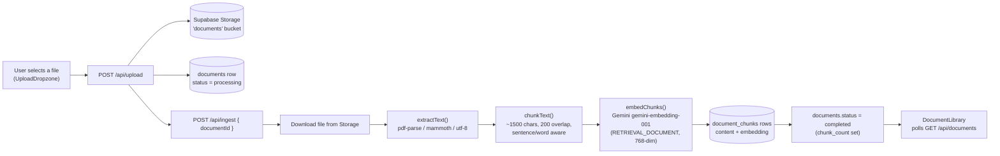
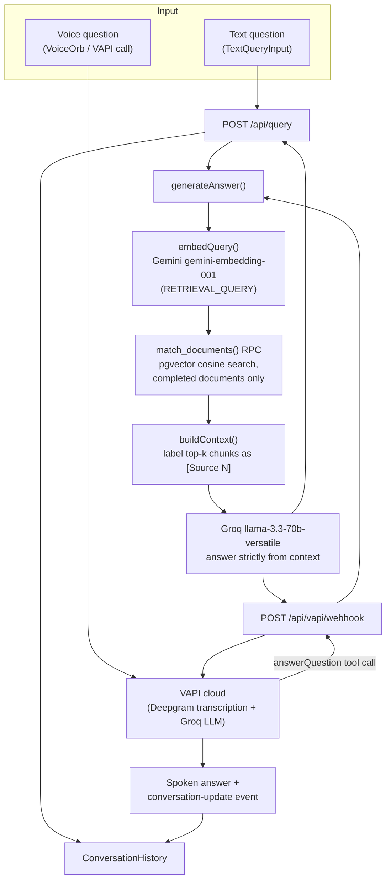

# Voice RAG Assistant

Ask questions about your own documents — by voice or by text — and get answers grounded strictly in
what you uploaded. Upload a PDF, DOCX, or TXT file, wait for it to be indexed, then either type a
question or tap the mic and talk to it. Every answer is retrieved from your documents via vector
search and generated by an LLM instructed to never go beyond that retrieved context, with cited
sources shown alongside each reply.

Installable as a PWA (works offline for the app shell, add-to-home-screen on mobile/desktop).

## Features

- **Drag-and-drop upload** for PDF, DOCX, and TXT files (15MB max), with live indexing status.
- **Voice conversations** powered by VAPI — real-time speech-to-text, an LLM, and text-to-speech
  wired into one call.
- **Text chat** as a lighter-weight alternative to voice, sharing the same conversation history.
- **Retrieval-augmented answers**: every response is grounded in the most similar chunks of your
  uploaded documents, with source attribution (document name + similarity score).
- **Document library** with per-document status (pending / processing / completed / failed) and
  deletion.
- **Dark/light mode** and an installable, offline-capable PWA shell.

## Tech stack

| Layer | Technology |
| --- | --- |
| Framework | [Next.js](https://nextjs.org) 16 (App Router), React 19, TypeScript |
| Styling | Tailwind CSS v4 |
| Client state | Zustand (conversation history store) |
| Database | [Supabase](https://supabase.com) Postgres + the [pgvector](https://github.com/pgvector/pgvector) extension |
| File storage | Supabase Storage (private `documents` bucket) |
| Text extraction | `pdf-parse` (PDF), `mammoth` (DOCX), native UTF-8 read (TXT) |
| Embeddings | Google Gemini `gemini-embedding-001` (truncated to 768 dimensions) |
| Answer generation | Groq `llama-3.3-70b-versatile` |
| Voice orchestration | [VAPI](https://vapi.ai) (Deepgram `nova-2` transcription, VAPI TTS voice, Groq as the in-call LLM) |
| PWA | Web app manifest + a hand-written service worker |

## Architecture

The app has two independent pipelines that share the same document store: **ingestion** (turning an
uploaded file into searchable, embedded chunks) and **query** (turning a question — spoken or typed —
into an answer grounded in those chunks).

### Ingestion flow



The upload route (`src/app/api/upload/route.ts`) only validates and stores the raw file; the ingest
route (`src/app/api/ingest/route.ts`) does the actual work and is called separately so the UI can show
a "processing" state immediately after upload. If any stage fails, `documents.status` is set to
`failed` with a user-facing `error_message` instead of leaving the row stuck in `processing`.

### Query flow



Both entry points funnel into the same `generateAnswer()` function
(`src/lib/rag/answer.ts`), so text and voice questions are answered identically and always cite the
same sources:

1. **Search** — `searchDocuments()` embeds the question with Gemini and calls the `match_documents`
   Postgres function (defined in `schema.sql`), which ranks `document_chunks` by cosine similarity
   over their `vector(768)` embeddings, restricted to documents with `status = 'completed'`.
2. **Assemble context** — `buildContext()` labels the top matches as `[Source 1]`, `[Source 2]`, etc.
3. **Generate** — Groq's `llama-3.3-70b-versatile` is instructed (via system prompt) to answer only
   from that labeled context and to say so plainly if the context doesn't cover the question, never
   to invent an answer.

For voice, the VAPI assistant (`src/lib/vapi/assistant.ts`) has no knowledge of the documents itself —
its system prompt requires it to call the `answerQuestion` tool for anything but small talk. VAPI's
cloud invokes that tool by calling our public webhook (`src/app/api/vapi/webhook/route.ts`), which is
why `NEXT_PUBLIC_APP_URL` must be an address VAPI's servers can reach (a tunnel like ngrok in local
dev, your real domain in production).

## Environment variables

Copy `.env.local.example` to `.env.local` and fill in every value below.

| Variable | Description | Exposed to browser? |
| --- | --- | --- |
| `NEXT_PUBLIC_SUPABASE_URL` | Your Supabase project's API URL. Found in **Project Settings → API**. | Yes (`NEXT_PUBLIC_`) |
| `NEXT_PUBLIC_SUPABASE_ANON_KEY` | Supabase's public anon key, safe to expose since access is governed by RLS policies. Found in **Project Settings → API**. | Yes (`NEXT_PUBLIC_`) |
| `SUPABASE_SERVICE_ROLE_KEY` | Supabase's service role key. Bypasses RLS — used server-side only (uploads, ingestion, search). **Never expose this to the browser.** Found in **Project Settings → API**. | No — server-only |
| `GEMINI_API_KEY` | Google Gemini API key, used to generate embeddings for both document chunks and queries. Get one at [aistudio.google.com/app/apikey](https://aistudio.google.com/app/apikey). | No — server-only |
| `GROQ_API_KEY` | Groq API key, used to generate the final grounded answer text. Get one at [console.groq.com/keys](https://console.groq.com/keys). | No — server-only |
| `NEXT_PUBLIC_VAPI_PUBLIC_KEY` | VAPI's public key, used by the browser SDK to start a voice call. Found in the [VAPI dashboard](https://dashboard.vapi.ai) under Account/Org settings. | Yes (`NEXT_PUBLIC_`) |
| `VAPI_PRIVATE_KEY` | VAPI's private key for authenticated server-side API calls. Keep this secret. Found in the same place as the public key. | No — server-only |
| `NEXT_PUBLIC_APP_URL` | The public base URL VAPI's cloud uses to reach this app's `/api/vapi/webhook` route during a voice call — e.g. an `ngrok` tunnel URL in local dev, your real domain in production. | Yes (`NEXT_PUBLIC_`) |

Anything without the `NEXT_PUBLIC_` prefix is only readable in server-side code (API routes) and is
never bundled into client JavaScript — that's what keeps the service role, Gemini, Groq, and VAPI
private keys safe.

## Local setup

1. **Clone the repo and install dependencies**

   ```bash
   git clone <this-repo-url>
   cd voice-rag-assistant
   npm install
   ```

2. **Create a Supabase project**

   Create a free project at [supabase.com](https://supabase.com). From **Project Settings → API**,
   note the project URL, anon public key, and service role key — you'll need them in step 4.

3. **Run the database schema**

   Open your project's **SQL Editor** in the Supabase dashboard, paste the entire contents of
   [`schema.sql`](./schema.sql), and run it. This enables the `pgvector` extension, creates the
   `documents` and `document_chunks` tables, creates the `match_documents` similarity-search
   function, creates the private `documents` Storage bucket, and sets up permissive RLS policies and
   grants suitable for this single-tenant demo. It's idempotent, so it's safe to re-run.

4. **Set up environment variables**

   ```bash
   cp .env.local.example .env.local
   ```

   Fill in every value described in [Environment variables](#environment-variables) above:
   Supabase (from step 2), a Gemini API key, a Groq API key, and VAPI keys (create an account at
   [dashboard.vapi.ai](https://dashboard.vapi.ai) if you don't have one). For `NEXT_PUBLIC_APP_URL`
   in local dev, start a tunnel (e.g. `ngrok http 3000`) and use the HTTPS URL it gives you — VAPI's
   cloud needs to reach your machine to call the webhook.

5. **Run the dev server**

   ```bash
   npm run dev
   ```

   Open [http://localhost:3000](http://localhost:3000) (or your tunnel URL, if you want voice calls
   to work end-to-end). Upload a file from [`sample-documents/`](./sample-documents) to try it out,
   wait for its status to show "completed" in the sidebar, then ask about it by text or by tapping
   the mic.

## Other scripts

```bash
npm run build   # production build
npm run start   # run the production build locally
npm run lint    # eslint
```
